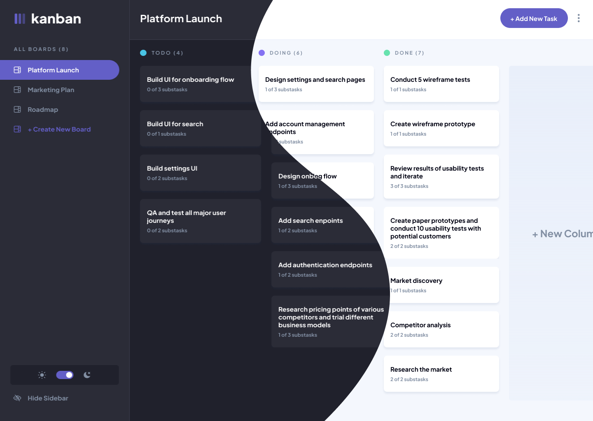

<div style="display: flex; align-items: center">
    <h1 style="margin-right: 6px">The React Kanban</h1>
    
</div>


## Description

**The React Kanban** is an educational project of a small team of web developers from Russia. Its main goal is to add a
pet-project to the portfolio and develop hard-skills.



## Stack

**Frontend**: React JS, Typescript, React Router, Redux Tool Kit, SCSS

**Backend**:

## Project setup

```
npm install
npm run dev
```

## Team
+ [Ruslan Gaziev](https://github.com/gazievri) - Frontend & Backend Developer
+ [Никита Леонов](https://github.com/le0n8914) - Frontend Developer
+ [Vlad](https://github.com/Valzet) - Frontend & Backend Developer
+ [Ксения Порфирьева](https://github.com/porfirieva) - Frontend Developer
+ [Полина Каминская](https://github.com/kaminskayaP) - Frontend Developer